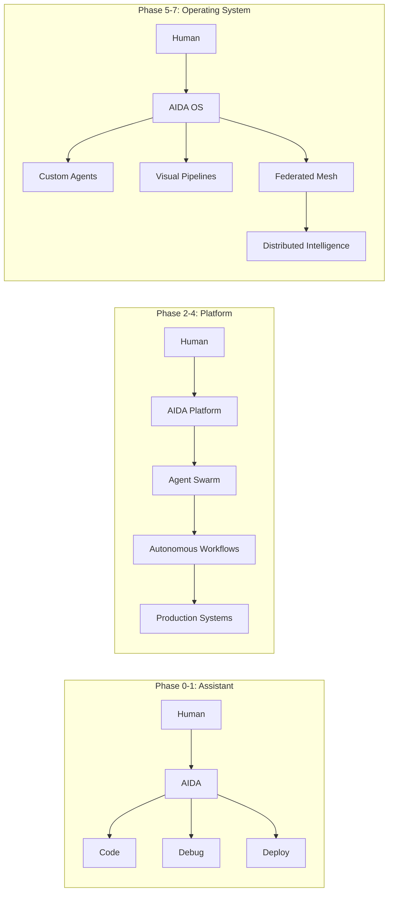

# AIDA — Vision Document

## 1. What Is AIDA?

AIDA (Artificial Intelligence Digital Assistant) is an **open-source, multi-agent AI Operating System** purpose-built for engineering intelligence. Unlike conventional chatbots or LLM wrappers that provide a thin interface over a single model, AIDA is a **complete horizontal platform** that orchestrates specialized AI agents, manages long-term memory, indexes and understands codebases, executes tools in sandboxed environments, routes requests across multiple LLM providers with automatic failover, and continuously self-improves through performance monitoring and structural analysis.

AIDA is not a product — it is a **platform for building AI-powered engineering workflows**. It provides the kernel, runtime, agent system, memory infrastructure, tool ecosystem, and security layer that enable both interactive use (chat, code generation, debugging) and autonomous operation (CI/CD integration, automated refactoring, continuous research).

## 2. What Problems Does AIDA Solve?

| Problem | How AIDA Solves It |
|---|---|
| **Provider Lock-In** | Pluggable gateway supports Ollama, Gemini, OpenAI, Anthropic, DeepSeek, LM Studio — switch without code changes |
| **Context Fragmentation** | Unified memory engine with session, conversation, code, user, project, and vector memory tiers |
| **Single-Agent Limitations** | Multi-agent orchestrator with 10+ specialized agents (code, debug, plan, research, test, security, docs, deploy, memory, monitor) |
| **Codebase Unfamiliarity** | AST-based codebase indexer with symbol search, dependency analysis, and cross-reference resolution |
| **Tool Sprawl** | Centralized tool system with registration, permissions, rate-limiting, and sandboxed execution |
| **Manual Refactoring** | Self-improvement subsystem monitors code quality metrics and proposes structural improvements |
| **Knowledge Silos** | Persistent knowledge store with TF-IDF + embedding-based semantic search across sessions |
| **AI Safety** | Access key authentication, sandboxed execution, input validation, parameterized queries, no eval/exec with user input |

## 3. Target Users

| User Persona | Primary Use Case | Value Proposition |
|---|---|---|
| **Software Developer** | Code generation, debugging, refactoring, code review | Context-aware AI that understands the entire codebase, not just the open file |
| **DevOps Engineer** | Infrastructure automation, Docker/K8s config, CI/CD pipelines | Autonomous agent that can plan, execute, and verify deployment workflows |
| **AI/ML Researcher** | Multi-agent experiments, prompt engineering, model evaluation | Pluggable model gateway + metrics collection for systematic comparison |
| **Engineering Manager** | Code quality monitoring, architecture enforcement, technical debt tracking | Self-improvement subsystem with automated audit reports |
| **Security Engineer** | Code audit, vulnerability scanning, dependency analysis | Security agent with sandboxed execution and access-controlled tools |
| **Startup / SMB** | All-in-one AI engineering assistant | Self-hosted, open-source, no per-seat licensing costs |
| **Enterprise** | Private AI development platform | On-premise deployment, air-gapped capable, full data sovereignty |

## 4. Core Capabilities

### 4.1 Multi-Agent Orchestration
AIDA operates a team of specialized agents, each with a defined expertise domain, model preference, and tool access profile. The orchestrator performs prompt analysis, intent classification, and priority-based task routing. Agents can delegate subtasks to peer agents — for example, a Code Agent can invoke a Security Agent for vulnerability review before finalizing generated code.

| Agent | Domain | Tools |
|---|---|---|
| Code Agent | Code generation, modification, review | File read/write, code search, syntax check |
| Debug Agent | Error analysis, stack trace diagnosis | Code execution, log analysis, breakpoint |
| Planner Agent | Multi-step task decomposition | Project analysis, dependency resolution |
| Research Agent | Web research, documentation lookup | Web search, HTTP fetch, knowledge store |
| Test Agent | Test generation, coverage analysis | Test runner, code coverage, mock framework |
| Security Agent | Vulnerability detection, audit | Static analysis, dependency check, sandbox |
| Documentation Agent | Docstring generation, README | Code analysis, knowledge store, template engine |
| Deployment Agent | Docker, CI/CD, cloud config | Shell execution, Docker API, cloud SDK |
| Memory Agent | Context management, summarization | Vector store, conversation compression |
| Monitoring Agent | Performance tracking, alerting | Metrics collection, log analysis, event bus |

### 4.2 LLM Provider Gateway
The gateway abstracts all LLM interactions behind a unified interface. Providers are registered as plugins with capabilities advertisement (model list, tool support, streaming, max tokens, cost per token). The gateway handles:
- **Automatic failover** — if primary provider fails, falls through configured priority list
- **Health caching** — provider status is cached with TTL to avoid repeated health checks
- **Capability-based routing** — tasks requiring tools are routed to providers that support function calling
- **Streaming abstraction** — uniform SSE stream format regardless of backend (Ollama chunk, Gemini SSE, OpenAI SSE)

### 4.3 Memory System
Six-tier memory architecture modeled after human cognitive hierarchy:

| Tier | Scope | Duration | Storage | Access Pattern |
|---|---|---|---|---|
| Session | Single conversation | Ephemeral | In-memory | FIFO with token budget |
| Conversation | Per-user chat history | Days | SQLite + summary | Sliding window + summarization |
| Code | Project-specific symbols | Persistent | SQLite + AST | Symbol lookup, dependency graph |
| User | User preferences + facts | Persistent | SQLite | Key-value + vector search |
| Project | Project context + decisions | Persistent | SQLite + embeddings | Semantic search |
| Vector | Cross-session semantic | Persistent | SQLite + embeddings | Cosine similarity + TF-IDF fusion |

### 4.4 Codebase Indexing
AST-based indexing engine that builds a queryable symbol graph:
- **Symbol index** — classes, functions, methods, variables with file:line:col positions
- **Dependency graph** — import relationships, function call edges, inheritance hierarchy
- **Cross-reference** — find all usages of a symbol across the codebase
- **Change impact** — given a file change, determine affected downstream code

### 4.5 Tool System
Extensible tool registry with four execution modes:

| Mode | Description | Security |
|---|---|---|
| Built-in | Python functions (search, math, date) | Whitelisted |
| Sandbox | Subprocess in restricted environment | Resource limits, no network |
| Plugin | Community-contributed tools | Permission-reviewed |
| External | HTTP calls to third-party APIs | Rate-limited, key-scoped |

### 4.6 Self-Improvement Subsystem
Continuous introspection loop that monitors:
- **Code quality metrics** — cyclomatic complexity, coupling, cohesion, test coverage
- **Performance metrics** — response latency, token usage, error rates per agent/provider
- **Structural metrics** — layer violation detection, dead code, circular dependencies
- Generates structured proposals for improvement with estimated effort/impact

### 4.7 Event Bus
In-process pub/sub event system enabling decoupled communication:
- `DomainEventType.TASK_CREATED`, `.TASK_COMPLETED`, `.TASK_FAILED`
- `.AGENT_STARTED`, `.AGENT_COMPLETED`, `.AGENT_ERROR`
- `.TOOL_EXECUTED`, `.TOOL_FAILED`
- `.MEMORY_STORED`, `.MEMORY_RETRIEVED`
- `.PROVIDER_SWITCHED`, `.PROVIDER_FAILED`

## 5. AI Components

The following components are AI-native — they require LLM inference or embedding models to function:

| Component | AI Function | Model Type Required |
|---|---|---|
| Agent Orchestrator | Intent classification, task routing, response generation | Chat LLM (instruction-tuned) |
| Each Specialized Agent | Domain reasoning, code generation, analysis | Chat LLM (may differ per agent) |
| Memory Embedding | Text-to-vector conversion for semantic search | Embedding model |
| Codebase Analyzer | Code summarization, explanation, refactoring | Chat LLM |
| Knowledge Extraction | Fact extraction from conversations | Chat LLM |
| Self-Improvement Analyzer | Code review, improvement proposal generation | Chat LLM |
| Research Agent | Web content summarization, cross-referencing | Chat LLM |

## 6. Backend (Non-AI) Components

| Component | Role | Technology |
|---|---|---|
| Django REST Framework | HTTP API layer | Django 4.2+ / DRF 3.15+ |
| SQLite Databases | Persistence (memory, sessions, knowledge, metrics) | SQLite + Django ORM |
| AST Codebase Indexer | Symbol extraction, dependency graph | Python `ast` module |
| DI Container | Dependency injection, service location | Custom (`aidaos/container.py`) |
| Event Bus | In-process pub/sub | Custom (`aidaos/domain/events.py`) |
| Authentication | Access key validation, session auth | Django auth + custom decorators |
| Monitoring | Metrics collection, logging | Custom + `psutil` |
| Config Management | Environment-based configuration | `python-dotenv` + dataclasses |
| Plugin Loader | Dynamic module discovery and registration | Custom (`aidaos/infrastructure/plugins/`) |

## 7. Agent Components

| Agent | Intelligence Source | Decision Scope |
|---|---|---|
| MultiAgentOrchestrator | Prompt analysis + keyword routing | Task classification, priority, delegation |
| TaskRouter | Regex patterns + intent scoring | Agent selection, fallback strategy |
| SelfImprovementOrchestrator | Metrics analysis + LLM proposals | Improvement prioritization |
| Each Agent | LLM + Tool set + Memory context | Domain-specific reasoning & execution |

## 8. Tool Components

| Tool | Execution Mode | Purpose |
|---|---|---|
| FileSystem | Sandbox | Read/write files within project scope |
| CodeSearch | Built-in | Symbol lookup, find references |
| WebSearch | External | Web research via search API |
| HTTPFetch | External | Raw HTTP requests |
| ShellExecute | Sandbox | Command execution with resource limits |
| CodeAnalyzer | Built-in | AST analysis, complexity metrics |
| TestRunner | Sandbox | Execute tests, capture results |
| PackageManager | Sandbox | Dependency operations |

## 9. Model Components

| Model Interface | Purpose | Abstraction Level |
|---|---|---|
| `BaseProvider` | LLM provider contract | Domain entity |
| `ProfessionalModelGateway` | Provider registry + routing | Infrastructure singleton |
| StreamingChunk | Uniform streaming type | Domain value object |
| ProviderConfig | Per-provider configuration | Domain value object |
| CapabilityAdvertisement | Model features advertisement | Domain value object |

Supported providers: Ollama, Google Gemini, OpenAI-compatible, Anthropic Claude, DeepSeek, LM Studio, Local (rule-based fallback).

## 10. Cloud / Infrastructure Components

| Component | Current | Target |
|---|---|---|
| Containerization | Docker (NVIDIA CUDA base) | Multi-stage, distroless production images |
| Orchestration | docker-compose | Kubernetes (production-grade) |
| Database | SQLite file-based | PostgreSQL + Redis (production) |
| Caching | None | Redis (session cache, provider health cache) |
| Object Storage | Filesystem | S3-compatible (MinIO / AWS S3) |
| Reverse Proxy | Not configured | Nginx / Traefik |
| CI/CD | None | GitHub Actions + ArgoCD |
| Monitoring | Custom logging | Prometheus + Grafana + Loki |
| Secrets | `.env` file | Vault / AWS Secrets Manager |
| Scaling | Single process | Horizontal pod autoscaling (K8s HPA) |

## 11. Development Phases

| Phase | Focus | Timeline |
|---|---|---|
| **Phase 0 — Foundation** | Clean Architecture migration complete; all 9 repo adapters implemented; legacy monolith decomposed; 158+ tests pass | Current |
| **Phase 1 — Production Readiness** | PostgreSQL migration, Redis caching, Docker Compose production profile, comprehensive testing, CI/CD pipeline | Next |
| **Phase 2 — Agent Intelligence** | Agent skill specialization, tool-use optimization, memory hierarchy tuning, self-improvement loop hardened | Near |
| **Phase 3 — Autonomous Mode** | Background autonomous agent operation, scheduled tasks, webhook integration, CI/CD event-driven triggers | Medium |
| **Phase 4 — Multi-Tenant** | Workspace isolation, team collaboration, project sharing, role-based access control | Medium |
| **Phase 5 — Visual Programming** | Drag-and-drop workflow builder, agent pipeline visualization, real-time execution graph | Far |
| **Phase 6 — Federated AI** | Cross-instance agent communication, distributed task execution, shared knowledge mesh | Far |
| **Phase 7 — AGI Pathway** | Meta-learning, cross-domain transfer, autonomous goal-setting, continuous self-evolution | Research |

## 12. Risk Analysis

| Risk | Probability | Impact | Mitigation |
|---|---|---|---|
| LLM provider API changes | High | Medium | Provider abstraction layer + fallback chain |
| Model hallucination in code generation | Medium | High | Sandboxed execution + Security Agent review + test validation |
| Performance degradation under load | Medium | High | Async architecture + caching + horizontal scaling |
| Security breach via tool system | Low | Critical | Sandbox resource limits + permission whitelist + audit logging |
| Community fragmentation (fork) | Low | Medium | Clear governance model + plugin ecosystem lock-in |
| Technical debt from legacy migration | Medium | Medium | Phased migration with feature parity gates at each phase |
| Single-developer bus factor | High | Critical | Comprehensive docs + test coverage + clean architecture modularity |
| Uzbek language market size | Medium | Medium | Internationalization-ready architecture; Uzbek as default, English as option |

## 13. Performance Goals

| Metric | Target | Measurement |
|---|---|---|
| API response (non-LLM) | < 200ms p95 | Request timer middleware |
| Streaming TTFS (time to first token) | < 500ms p95 | SSE first-chunk timer |
| Concurrent sessions | 500+ | Load test (locust / k6) |
| Agent dispatch latency | < 50ms | Event bus timer |
| Memory retrieval (vector) | < 100ms p95 | Query timer |
| Codebase index — 100k LOC | < 30s full index | Index timer |
| Codebase search | < 50ms | Search timer |
| Startup time | < 3s cold | Process timer |
| Throughput | 1000+ requests/min | Request counter / minute |

## 14. Security Goals

| Domain | Goal | Implementation |
|---|---|---|
| Authentication | Multi-factor, API key + JWT | Django auth + DRF tokens + custom decorators |
| Authorization | Role-based (admin, user, readonly) | Permission model in `webapp/security.py` |
| Input Validation | All user input validated at boundary | DTO validation + DRF serializers + sanitization |
| Code Execution | Sandboxed with resource limits | `webapp/sandbox.py` with CPU/memory/time limits |
| SQL Injection | Zero — parameterized queries only | Django ORM + whitelist for raw SQL |
| Prompt Injection | Context isolation + instruction defense | System prompt hardening + user input sanitization |
| Secrets Management | No secrets in code, all in env/Vault | `.env` + Vault integration planned |
| Audit | All access logged | Structured logging with correlation IDs |
| Rate Limiting | Per-key, per-endpoint | DRF throttling + custom middleware |
| Network | TLS everywhere in production | Nginx reverse proxy termination |

## 15. Architecture Goals

| Principle | Goal | Verification |
|---|---|---|
| Clean Architecture | Strict inward dependency direction | Automated layer violation test |
| SOLID | Single Responsibility per module | Cyclomatic complexity < 15 per module |
| DRY | Zero code duplication in business logic | Dedicated lint rule |
| High Cohesion | Related behavior in same module | Package cohesion metrics |
| Low Coupling | Interface-based inter-module communication | Dependency graph analysis |
| Event-Driven | Decoupled async communication via EventBus | Event subscription coverage |
| Pluggable | Zero-code-change extension points | Plugin registration acceptance tests |
| Testable | All use cases testable with mock repos | 90%+ of use cases covered |
| Observable | Every action logged and measurable | Structured logging + metrics counters |

## 16. Scalability Goals

| Dimension | Horizontal | Vertical |
|---|---|---|
| API Layer | Multiple Django instances behind load balancer | Increase worker count (gunicorn/uvicorn) |
| Agent Execution | Distributed agent workers (Celery / NATS) | Increase per-worker thread pool |
| LLM Provider | Round-robin across provider instances | GPU upgrade (more VRAM) |
| Memory Store | Read replicas (PostgreSQL) | Increase RAM + connection pool |
| Knowledge Index | Sharded by project | Increase CPU cores for indexing |
| File System | S3-compatible object storage | Larger SSD / NVMe |

## 17. Maintainability Goals

| Metric | Target | Tool |
|---|---|---|
| Cyclomatic Complexity | < 10 per function | `radon` / `mccabe` |
| Cognitive Complexity | < 15 per function | `lizard` |
| Lines per file | < 500 (production), < 1000 (total) | `cloc` / `sloccount` |
| Dependency depth | < 3 layers | Custom analyzer |
| Cohesion (LCOM) | > 0.8 | Custom metric |
| Coupling (CBO) | < 10 per class | Custom metric |
| Test coverage | > 80% | `coverage.py` |
| Documentation coverage | > 90% of public APIs | `interrogate` |
| Type hint coverage | 100% of production code | `mypy` |
| Unused code | 0 dead imports/functions | `vulture` / `autoflake` |

## 18. Testing Strategy

| Layer | Test Type | Framework | Coverage Target |
|---|---|---|---|
| Domain | Unit (entities, events, exceptions) | Custom harness / pytest | 100% of all domain logic |
| Application | Unit (use cases with mock repos) | pytest + unittest.mock | 100% of all use cases |
| Infrastructure | Integration (adapters with real DB/files) | pytest + tmp_path | 90% of adapter code |
| Presentation | Integration (API endpoints) | DRF APITestCase / httpx | 90% of endpoints |
| Frontend | Component + E2E | Vitest + Playwright | 80% of components |
| Agents | Integration (mock LLM, real tools) | pytest + custom mock providers | Core agent paths |
| Performance | Load test | k6 / locust | Defined SLOs |
| Security | SAST + dependency scan | bandit / semgrep / pip-audit | Zero critical/high |

## 19. Deployment Strategy

| Environment | Method | Target | Notes |
|---|---|---|---|
| Development | Docker Compose + hot-reload | Local machine | Frontend Vite dev server + Django runserver |
| Staging | Docker Compose + production profile | Single VM | Nginx + Gunicorn + PostgreSQL + Redis |
| Production — Small | Docker Compose + production profile | Single server | < 50 concurrent users, SQLite is borderline |
| Production — Medium | Docker Compose + psql + redis | 2-3 VMs | 50-500 concurrent users |
| Production — Large | Kubernetes | Cloud (AWS/GCP/Azure) | 500+ concurrent users, HA, auto-scaling |

## 20. Long-Term Vision

AIDA evolves from an **AI engineering assistant** to an **autonomous AI engineering platform**:

The ultimate goal: **AIDA becomes the operating system for AI-driven software engineering** — an open, extensible, self-improving platform where human developers define goals and AIDA orchestrates the means. Every component — agents, tools, models, memory, knowledge — is a pluggable module. The platform learns from every interaction, improves its own codebase, adapts to new technologies, and grows with its community.

AIDA competes not by imitating Claude Code or Cursor, but by redefining what an AI development platform can be: not a copilot, not a chat, but an **operating system for software intelligence**.
