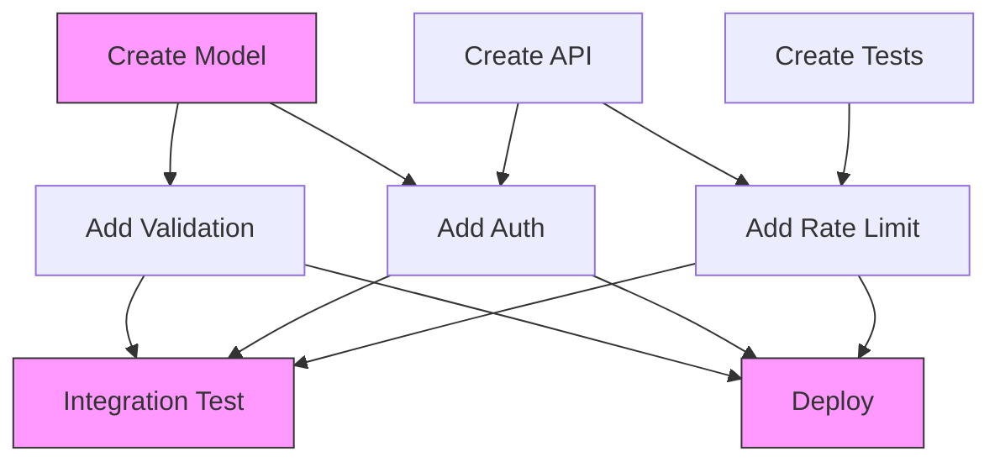

# AIDA Dependency Graph

**Document:** Book 2, Chapter 3 — Dependency Graph
**Version:** 1.0.0
**Date:** 2026-07-04

---

## 1. Overview

The Dependency Graph models task relationships, execution order, parallelism opportunities, and critical paths. It ensures tasks execute in the correct order while maximizing parallel execution of independent tasks.

---

## 2. Graph Structure

### 2.1 Directed Acyclic Graph (DAG)

```
┌─────────────────────────────────────────────────────────────────┐
│                    DEPENDENCY GRAPH (DAG)                        │
│                                                                  │
│  Task A ──────────→ Task D ──────────→ Task G                   │
│    │                  │                  │                       │
│    ↓                  ↓                  ↓                       │
│  Task B ──────────→ Task E ──────────→ Task H                   │
│    │                  │                                         │
│    ↓                  ↓                                         │
│  Task C ──────────→ Task F                                     │
│                                                                  │
│  Legend: ──→ = depends on (finish-to-start)                     │
│          A→D means D waits for A to finish                      │
└─────────────────────────────────────────────────────────────────┘
```

### 2.2 Node Properties

```python
class DependencyNode:
    task_id: UUID
    task: Task
    
    # Graph properties
    in_degree: int       # Number of incoming edges
    out_degree: int      # Number of outgoing edges
    level: int           # Topological level (0 = no dependencies)
    
    # Timing
    earliest_start: int  # Earliest possible start (seconds)
    earliest_finish: int # Earliest possible finish
    latest_start: int    # Latest possible start without delay
    latest_finish: int   # Latest possible finish without delay
    slack: int           # Float time (latest_start - earliest_start)
    
    # Path
    is_on_critical_path: bool
    critical_path_id: Optional[str]
```

---

## 3. Dependency Types

### 3.1 Standard Dependencies

| Type | Symbol | Description | Example |
|------|--------|-------------|---------|
| Finish-to-Start (FS) | A→B | B starts after A finishes | Test after code |
| Finish-to-Finish (FF) | A↔B | B finishes after A finishes | Docs with code |
| Start-to-Start (SS) | A⇒B | B starts when A starts | Parallel features |
| Start-to-Finish (SF) | A⇐B | B finishes when A starts | Handoff tasks |

### 3.2 Dependency Relationships

| Relationship | Description | Example |
|--------------|-------------|---------|
| `blocks` | B cannot start until A finishes | Code before test |
| `requires` | B needs output from A | Model before API |
| `enables` | A makes B possible | Design before code |
| `constraints` | A limits how B can execute | Security limits |

### 3.3 Dependency Metadata

```python
class Dependency:
    from_task_id: UUID
    to_task_id: UUID
    dependency_type: str  # FS, FF, SS, SF
    relationship: str     # blocks, requires, enables, constraints
    
    # Lag/Lead
    lag: int = 0          # Delay after dependency (seconds)
    lead: int = 0         # Advance before dependency (seconds)
    
    # Condition
    condition: Optional[str]  # Conditional dependency
    
    # Metadata
    created_at: datetime
    reason: str           # Why this dependency exists
```

---

## 4. Graph Operations

### 4.1 Topological Sort

```python
def topological_sort(graph: DependencyGraph) -> list[list[Task]]:
    """
    Returns tasks in execution order (level by level).
    Tasks at same level can run in parallel.
    """
    levels = []
    visited = set()
    
    while len(visited) < len(graph.nodes):
        # Find tasks with no unvisited dependencies
        ready = [
            node for node in graph.nodes
            if node.task_id not in visited
            and all(dep in visited for dep in node.dependencies)
        ]
        
        if not ready:
            raise CyclicDependencyError("Graph has cycles!")
        
        levels.append([node.task for node in ready])
        visited.update(node.task_id for node in ready)
    
    return levels
```

**Example Output:**
```
Level 0: [Task A, Task B, Task C]  (parallel)
Level 1: [Task D, Task E]          (parallel, wait for A, B)
Level 2: [Task F]                  (wait for B, C)
Level 3: [Task G, Task H]          (parallel, wait for D, E, F)
```

### 4.2 Cycle Detection

```python
def detect_cycles(graph: DependencyGraph) -> list[list[UUID]]:
    """Detect all cycles in the dependency graph."""
    cycles = []
    visited = set()
    rec_stack = set()
    
    def dfs(node_id, path):
        visited.add(node_id)
        rec_stack.add(node_id)
        path.append(node_id)
        
        for neighbor in graph.get_dependencies(node_id):
            if neighbor not in visited:
                dfs(neighbor, path)
            elif neighbor in rec_stack:
                # Found cycle
                cycle_start = path.index(neighbor)
                cycle = path[cycle_start:] + [neighbor]
                cycles.append(cycle)
        
        path.pop()
        rec_stack.remove(node_id)
    
    for node in graph.nodes:
        if node.task_id not in visited:
            dfs(node.task_id, [])
    
    return cycles
```

### 4.3 Critical Path Analysis

```python
def critical_path_analysis(graph: DependencyGraph) -> CriticalPath:
    """
    Find the longest path through the graph.
    This determines minimum project duration.
    """
    # Forward pass (earliest times)
    for node in graph.topological_order():
        node.earliest_start = max(
            dep.earliest_finish + dep.lag
            for dep in node.dependencies
        ) if node.dependencies else 0
        node.earliest_finish = node.earliest_start + node.task.estimated_duration
    
    # Backward pass (latest times)
    project_duration = max(node.earliest_finish for node in graph.nodes)
    
    for node in reversed(graph.topological_order()):
        node.latest_finish = min(
            dep.latest_start - dep.lag
            for dep in node.dependents
        ) if node.dependents else project_duration
        node.latest_start = node.latest_finish - node.task.estimated_duration
    
    # Calculate slack and identify critical path
    critical_nodes = []
    for node in graph.nodes:
        node.slack = node.latest_start - node.earliest_start
        node.is_on_critical_path = (node.slack == 0)
        if node.is_on_critical_path:
            critical_nodes.append(node)
    
    return CriticalPath(
        nodes=critical_nodes,
        duration=project_duration,
        tasks=[node.task for node in critical_nodes]
    )
```

### 4.4 Parallel Groups

```python
def find_parallel_groups(graph: DependencyGraph) -> list[list[Task]]:
    """Find groups of tasks that can run in parallel."""
    levels = topological_sort(graph)
    return levels  # Each level is a parallel group
```

---

## 5. Dependency Visualization

### 5.1 ASCII Visualization

```
Task Dependency Graph:
═════════════════════

Level 0 (Start):
  [A: Create Model] ─────┐
  [B: Create API] ───────┤
  [C: Create Tests] ─────┤
                         │
Level 1:                 │
  [D: Add Validation] ◄──┘ (depends on A)
  [E: Add Auth] ◄────── (depends on A, B)
                         │
Level 2:                 │
  [F: Add Rate Limit] ◄── (depends on B, C)
                         │
Level 3 (End):           │
  [G: Integration Test] ◄ (depends on D, E, F)
  [H: Deploy] ◄────────── (depends on D, E, F)

Critical Path: A → D → G (8h)
Total Duration: 8h
Parallel Potential: 60%
```

### 5.2 Mermaid Diagram



---

## 6. Dependency Rules

### 6.1 Validation Rules

| Rule | Description | Violation |
|------|-------------|-----------|
| No Cycles | Graph must be acyclic | Circular dependency |
| No Self-Dependencies | Task cannot depend on itself | Self-loop |
| Valid References | All dependency IDs must exist | Missing task |
| No Duplicates | No duplicate dependencies | Redundant edge |
| Transitive Reduction | Remove implied dependencies | Redundant path |

### 6.2 Transitive Reduction

```
Before: A → B → C, A → C (implied by A → B → C)
After:  A → B → C (remove A → C)

Before: A → B, A → C, B → C (B → C implied by A → B → C)
After:  A → B, A → C (remove B → C)
```

```python
def transitive_reduction(graph: DependencyGraph) -> DependencyGraph:
    """Remove implied (redundant) dependencies."""
    reduced = graph.copy()
    
    for node in reduced.nodes:
        for dep in node.dependencies:
            # Check if there's another path from dep to node
            if has_alternative_path(reduced, dep, node.task_id, exclude=node.task_id):
                # This dependency is implied, remove it
                reduced.remove_dependency(dep, node.task_id)
    
    return reduced
```

---

## 7. Graph Metrics

### 7.1 Key Metrics

| Metric | Description | Calculation |
|--------|-------------|-------------|
| Total Tasks | Number of tasks in graph | `len(nodes)` |
| Total Dependencies | Number of edges | `len(edges)` |
| Density | Dependency ratio | `edges / (nodes * (nodes-1) / 2)` |
| Critical Path Length | Longest path duration | Critical path analysis |
| Max Parallelism | Maximum concurrent tasks | Max level size |
| Average Parallelism | Average concurrent tasks | Total tasks / levels |
| Depth | Maximum hierarchy depth | Max level number |

### 7.2 Graph Health

```python
class GraphHealth:
    density: float           # 0.0 - 1.0 (lower is better)
    critical_path_ratio: float  # Critical tasks / total tasks
    parallelism_score: float    # Parallel tasks / total tasks
    dependency_score: float     # Dependencies / tasks
    
    def is_healthy(self) -> bool:
        return (
            self.density < 0.3 and          # Not too dense
            self.critical_path_ratio < 0.5 and  # Not too many critical tasks
            self.parallelism_score > 0.3     # Good parallelism
        )
```

---

## 8. Dynamic Dependencies

### 8.1 Conditional Dependencies

```python
class ConditionalDependency:
    condition: str  # Python expression
    true_dependency: Optional[Dependency]
    false_dependency: Optional[Dependency]
    
    def evaluate(self, context: dict) -> Optional[Dependency]:
        if eval(self.condition, context):
            return self.true_dependency
        return self.false_dependency
```

### 8.2 Runtime Dependencies

```python
class RuntimeDependency:
    """Dependencies discovered during execution."""
    task_id: UUID
    depends_on_output: str  # Output from another task
    resolved: bool = False
    
    def resolve(self, output: TaskOutput):
        self.resolved = True
        # Update task dependencies
```

---

## 9. Configuration

```yaml
dependency_graph:
  # Validation
  validation:
    detect_cycles: true
    validate_references: true
    check_duplicates: true
    transitive_reduction: true
    
  # Analysis
  analysis:
    critical_path: true
    parallel_groups: true
    graph_metrics: true
    
  # Limits
  limits:
    max_nodes: 1000
    max_edges: 5000
    max_depth: 20
    
  # Visualization
  visualization:
    ascii: true
    mermaid: true
    json: true
```
